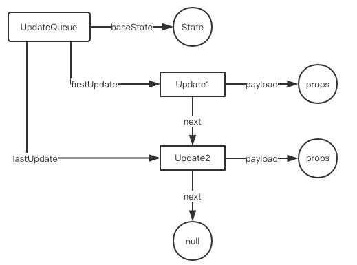

本文用于描述一次完整的React首次渲染的过程。不涉及大量具体源码。

#### 入口

```js
ReactDOM.render(<App />, document.getElementById('root'));
```

#### 从调用栈中的执行情况，可以看到首先会处理`<App />`这部分，结果就是将`<App />`转化成一个普通的js对象，也就是`React Element`。

  涉及的主要函数包括（按调用顺序）：

  1. `createElementWithValidation`：这个函数位于`/packages/react/src/ReactElementValidator.js`
  2. `createElement`：这个函数位于`/packages/react/src/ReactElement.js`
  3. `ReactElement`：返回一个普通对象。这个函数位于`/packages/react/src/ReactElement.js`

#### 之后会执行`ReactDOM.render()`这部分

  `legacyRenderSubtreeIntoContainer()`，这个函数位于`/packages/react-dom/src/client/ReactDOM.js`。

  这个函数可以分为三部分，执行三个重要的过程：

  1. 创建root
  2. render或renderSubtreeIntoContainer
  3. DOMRenderer.getPublicRootInstance

##### 1. 创建root

具体过程都封装在`legacyCreateRootFromDOMContainer`这个函数(位于`packages/react-dom/src/client/ReactDOM.js`)中。

这个函数做了创建了三个对象，并加工了容器

1. 创建了`ReactRoot`实例对象

  这个实例对象通过`new`的方式创建，原型上定义了`render`，`unmount`，`legacy_renderSubtreeIntoContainer`以及`createBatch`四个方法。前三个方法都涉及操控work。

  这个对象的`_internalRoot`指向下面描述的对象。

2. 创建了`FiberRoot`对象

  这个对象是字面量创建。

  目前两个看到的属性：

  - current：指向一个fiber对象

  - containerInfo：指向之前传入的真实的元素节点

3. 创建了`Fiber`对象

  这个实例由`new`的方式创建，构造函数是`FiberNode`，所有的`fiber`都是它的实例对象。

4. 创建`container`

经过`legacyCreateRootFromDOMContainer`后，`container`增加了下面的东西：
```js
container = {
    _reactRootContainer: {
        _internalRoot: {
            current: {

            }
        }
    }
}
```

##### 2. render

首次渲染走的是`render`这条路。

`render`的代码如下：

  ```js
  ReactRoot.prototype.render = function(
  children: ReactNodeList,
  callback: ?() => mixed,
  ): Work {
  const root = this._internalRoot;
  const work = new ReactWork();//.........................................................创建work
  callback = callback === undefined ? null : callback;
  if (__DEV__) {
    warnOnInvalidCallback(callback, 'render');
  }
  if (callback !== null) {
    work.then(callback);
  }
  DOMRenderer.updateContainer(children, root, null, work._onCommit);//.....................更新容器
  return work;
  };
  ```

`render`中主要执行两个部分：

  1. 创建一个`work`

  `ReactWork.prototype`上定义了两个方法：

  - `then`：用来将回调函数推入保存集合

  - `_onCommit`：用来执行上面的保存集合的所有回调函数

  2. 更新容器

  注意`DOMRenderer.updateContainer`中传入的参数

  说实话，不觉得这个函数起名叫`updateContainer`是准确的。`updateContainer`函数完成了创建优先级的任务，并将`优先级`和`fiber`一同传入`updateContainerAtExpirationTime`。

```
updateContainer
|_updateContainerAtExpirationTime
  |_scheduleRootUpdate
    |_enqueueUpdate
    | |_createUpdateQueue
    |_scheduleWork
      |_scheduleWorkToRoot
      |_requestWork
          |_performWork
            |_performWorkOnRoot
              |_renderRoot
              | |_createWorkInProgress
              | |_workLoop
              |   |_performUnitOfWork
              |     |_beginWork
              |       |_updateClassComponent
              |       | |_constructClassInstance
              |       | |_adoptClassInstance
              |       | |_mountClassInstance
              |       | |_finishClassComponent
              |       |_updateHostRoot
              |         |_processUpdateQueue
              |         |_reconcileChildren
              |           |_reconcileChildFibers
              |             |_placeSingleChild
              |               |_reconcileSingleElement
              |                 |_createFiberFromElement
              |                   |_createFiber
              |_completeRoot
```
  - `updateContainerAtExpirationTime`函数

  获取了`container.context`属性，然后继续调用`scheduleRootUpdate`函数

  - `scheduleRootUpdate`函数(/packages/react-reconciler/src/ReactFiberReconciler.js)

  创建了`update`对象，之后先调用`enqueueUpdate`函数，再调用`scheduleWork`函数。

  `update`对象

    在调度算法执行过程中，会将需要进行变更的工作以一个Update对象来表示。同一个updateQueue对列中的update对象会通过next属性串联起来，形成一个单链表。

  `update`对象得重要属性：

    - tag：Number类型。当前有0~3，分别是UpdateState、ReplaceState、ForceUpdate、CaptureUpdate。
        1. UpdateState：如果payload是普通对象，则把它当做新state。如果payload是函数，则把执行函数得到得返回值作为新state。如果新state不为空，则与原来得State进行和并，返回一个新对象。**`setState`设置state得和并是在此处处理得？**
        2. ReplaceState：直接返回这里的payload。如果payload是函数，则使用它得返回值作为新的state。
        3. ForceUpdate：仅仅设置`hasForceUpdate`为`true`，返回原始得state。
        4. CaptureUpdate：仅仅是将`workInProgress.effectTag`设置为清空`shouldCapture`标记位，增加`didCapture`标记位。
    - payload：Function|Object类型。表示这个更新对应的**数据内容**。
    - callback：Function类型。表示更新后得回调函数，如果这个回调有值，就会在UpdateQueue得副作用链表中挂载当前update对象。
    - next：update对象类型。updateQueue中得update对象之间通过next来串联，表示下一个update对象。

  [这篇文章](https://www.cnblogs.com/lcllao/p/9642376.html)中有说到`update.payload`中保存的是jsx组件的`ReactElement`，之前没注意，这里补充一下。

  - `createUpdateQueue`函数

  这个函数源码如下：

  ```js
    function createUpdateQueue<State>(baseState: State): UpdateQueue<State> {
      const queue: UpdateQueue<State> = {
        baseState,
        firstUpdate: null,
        lastUpdate: null,
        firstCapturedUpdate: null,
        lastCapturedUpdate: null,
        firstEffect: null,
        lastEffect: null,
        firstCapturedEffect: null,
        lastCapturedEffect: null,
      };
      return queue;
    }
  ```
  `updateQueue`是个对象，有如下属性：

      - baseState：普通对象。表示更新前的基础状态。
      - firstUpdate：Update对象。第一个Update对象的引用，总体是一条单链表。
      - lastUpdate：Update对象。最后一个Update对象的引用。
      - firstEffect：Update对象。第一个包含副作用(Callback)的Update对象得引用。
      - lastEffect：Update对象。最后一个包含副作用(Callback)的Update对象得引用。

  

  - `enqueueUpdate`函数

  这个函数主要使用来将`update`对象插入到更新队列。queue使用了链表的结构。

  - `scheduleWork`函数

  在首次渲染阶段，`scheduleWorkToRoot`做了2项工作：

  1. 给`fiber.expirationTime`设置了过期时间1(更新了fiber实例的过期时间)
  2. 返回了`fiber.stateNode`，这个对象指向`createFiberRoot`函数创建的那个对象

  - `requestWork`函数

  这个函数判断是应该同步执行work还是异步执行work

  - `performWork`函数

  - `createWorkInProgress`函数(packages/react-reconciler/src/ReactFiber.js)

  `workInProgress`：workInProgress tree是reconcile过程中从fiber tree建立的当前进度快照，用于断点恢复。以fiber tree为蓝本，把每个fiber作为一个工作单元，自顶向下逐节点构造workInProgress tree。workInprogress本质是一个fiber对象。

  这个函数实际就是利用`current`中保存的fiber对象，创建了一个几乎一模一样的fiber对象。

  - `workLoop`函数

  这个函数就是[这篇文章](https://juejin.im/post/5b7016606fb9a0099406f8de)中所说的`大循环`。

  workLoop函数的源码如下：

  ```js
  function workLoop(isYieldy) {
    if (!isYieldy) {
      // Flush work without yielding
      while (nextUnitOfWork !== null) {
        nextUnitOfWork = performUnitOfWork(nextUnitOfWork);
      }
    } else {
      // Flush asynchronous work until the deadline runs out of time.
      while (nextUnitOfWork !== null && !shouldYield()) {
        nextUnitOfWork = performUnitOfWork(nextUnitOfWork);
      }
    }
  }
  ```
  [这篇文章](https://www.cnblogs.com/lcllao/p/9642376.html)说到，workLoop中的这行代码`nextUnitOfWork = performUnitOfWork(nextUnitOfWork);`是个典型的递归转循环的写法。这样写成循环，一个是避免调用栈不断堆叠以及调用栈溢出的问题;而是结合其他Scheduler代码的辅助变量，可以实现遍历随时终止，随时恢复的效果。

  - `performUnitOfWork`函数

  这个函数的参数是一个`workInProgress`对象。

  在这个函数中会调用`beginWork`这个函数。

  - `beginWork`函数

  这个函数接受三个参数：current(fiber)，workInProgress(fiber)，renderExpirationTime，会返回当前节点的子节点。

  这个函数内部有众多分支，根据`workInProgress.tag`的类型进入不同分支走不同的更新函数。首次渲染的时候，没有走第一个条件分支，整个这个分支是用来处理Context的。通过`workInProgress.tag`找到`HostRoot`分支，执行`updateHostRoot`函数并返回返回值，这个返回值是一个fiber对象。

  **在React的事务风格中，一个work会分为begin和commit两个阶段。**

  - `updateHostRoot`函数

  [这篇文章](https://www.cnblogs.com/lcllao/p/9642376.html)说这个函数主要做了两件事：

    1. 处理更新队列，得出新的state，完成任务的函数是`processUpdateQueue`。整体而言，这个方法要做得事情就是遍历这个UpdateQueue，然后计算出最后得新的State，然后存到`workInProgress.memoizedState`中。

    2. 创建或更新FiberNode的child，得到下一个工作循环的入参(也是一个fiberNode对象)，完成任务得函数是`reconcileChildren`(packages/react-reconciler/src/ReactFiberBeginWork.js)

  - `processUpdateQueue`函数

  - `reconcileChildren`函数

  - `reconcileChildFibers`函数

    这个函数中有一部分代码是根据`newChild`对象的`$$type`属性的值得不同执行不同的操作。首次渲染时，此处的属性为：`$$typeof:Symbol(react.element)`，走第一条分支。

    ```js
      if (isObject) {
          switch (newChild.$$typeof) {
            case REACT_ELEMENT_TYPE:
              return placeSingleChild(reconcileSingleElement(returnFiber, currentFirstChild, newChild, expirationTime));

            case REACT_PORTAL_TYPE:
              return placeSingleChild(reconcileSinglePortal(returnFiber, currentFirstChild, newChild, expirationTime));
          }
        }
    ```
  
  - `reconcileSingleElement`函数

    先给`<App />`创建了一个对应得fiberNode，并返回继续大循环。再次进入`beginWork`函数，走ClassComponent分支。

  - `updateClassComponent`函数

    `beginWork`函数中`<App />`的fieberNode会走这个分支。

  - `constructClassInstance`函数(packages/react-reconciler/src/ReactFiberClassComponent.js)
  
  这个函数主要用来实例化`ReactComponent`，最后会返回这个实例，但是在首次渲染中好像没有用到这个返回值。

    1. 通过`new`Class的constructor函数初始化了组件实例。
    2. 通过instance.state给workInProgress.memoizedState赋了初始值
    3. 将workInProgress和instance传入adoptClassInstance函数

  - `adoptClassInstance`函数

    在这个函数里会给实例添加一个updater属性，属性值是`classComponentUpdater`。这是一个对象，其中包含了`isMounted`,`enqueueSetState`,`enqueueReplaceState`,`enqueueForceUpdate`四个函数。

    之后调用了这个函数`ReactInstanceMap.set(instance, workInProgress)`，注释说这行代码得作用是让instance能够拿到fiber对象，然后instance才能够安排更新。这个方法很简单，就是给isntance添加了一个`_reactInternalFiber`属性，属性值是对应的fiber。

    之后会返回进入`mountClassInstance`函数。

  - `mountClassInstance`函数

  这个函数的注释写道：

  >Invokes the mount life-cycles on a previously never rendered instance.

  **mount是生命周期中的一环！！！**

  这个函数中能执行得过程包括：

  1. processUpdateQueue
  2. getDerivedStateFromProps
  3. componentWillMount

  首次渲染这些都不存在，直接跳出。

  - `finishClassComponent`函数(packages/react-reconciler/src/ReactFiberBeginWork.js)

  该函数中会有一个设置`phase`得函数，用来设置当前所处得阶段。`setCurrentPhase()`

  该函数中的这行代码：`nextChildren = instance.render()`，会调用`createElement`函数。

  ~~返回得是这样得jsx，但是最外层得`<div className="App">`以及`<header className="App-header">`和它里面的内容好像走的不同的流程，这里好奇怪，不知道发生了神马...~~

  ```js
  return (
    <div className="App">
      <header className="App-header">
        <div>{count}</div>
        <button onClick={this.onClick}>add</button>
      </header>
    </div>
  );
  ```

  都走了创建虚拟节点的过程，只不过创建顺序是从内到外，同级按先后顺序。内部创建的虚拟节点对象作为外部虚拟节点对象中`children`属性的值。`nextChildren = instance.render()`这行代码会将上面`return`包裹的全部标签一次性(创建的过程是分开的)全部创建好，也就是说此处的`nextChildren`包含的是一棵完整的虚拟节点对象树。

  接着该函数向`reconcileChildren`中传入这个新获得的虚拟节点对象。