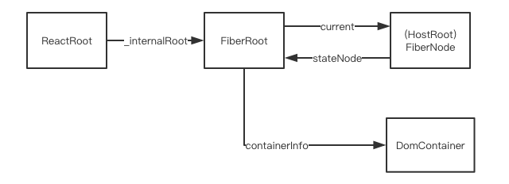
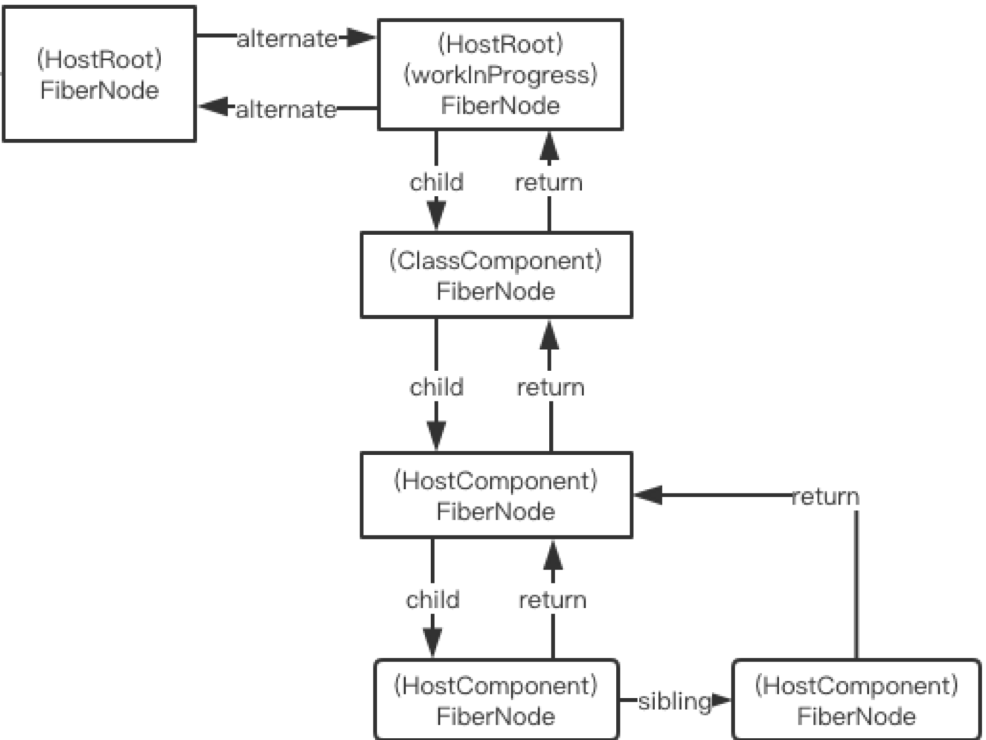
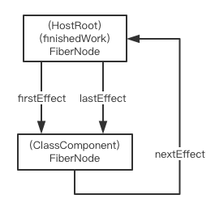

本文是首次渲染流程的记录草稿，主要记录了渲染过程经历的函数调用以及函数完成的任务。

### 入口

```js
ReactDOM.render(<App />, document.getElementById('root'));
```
---
### 创建React Element

从调用栈中的执行情况，可以看到首先会处理`<App />`这部分，结果就是将`<App />`转化成一个普通的js对象，也就是<span id="App-vDOM">**React Element**</span>。

  涉及的主要函数包括（按调用顺序）：

  1. `createElementWithValidation`：这个函数位于`/packages/react/src/ReactElementValidator.js`
  2. `createElement`：这个函数位于`/packages/react/src/ReactElement.js`
  3. `ReactElement`：返回一个普通对象。这个函数位于`/packages/react/src/ReactElement.js`

  此时创建的**React Element**对象和主要属性包括：

| 属性       | 值                     |
| -------- | --------------------- |
| $$typeof | Symbol(react.element) |
| props    | {}                    |
| type     | App()的constructor函数   |


---
### 之后会执行`ReactDOM.render()`这部分

  `legacyRenderSubtreeIntoContainer()`，这个函数位于`/packages/react-dom/src/client/ReactDOM.js`。

  这个函数可以分为三部分，执行三个重要的过程：

  1. 创建root
  2. render或renderSubtreeIntoContainer
  3. DOMRenderer.getPublicRootInstance

#### 1. 创建root

具体过程都封装在`legacyCreateRootFromDOMContainer`这个函数(位于`packages/react-dom/src/client/ReactDOM.js`)中。

这个函数创建了三个对象，并加工了容器。

1. 创建了`ReactRoot`实例对象

    这个实例对象通过`new`的方式创建，原型上定义了`render`，`unmount`，`legacy_renderSubtreeIntoContainer`以及`createBatch`四个方法。前三个方法都涉及操控work。

    这个对象的`_internalRoot`指向下面描述的对象。

    **ReactRoot**对象首次渲染涉及的属性和方法：

    | 属性            | 值         |
    | ------------- | --------- |
    | _internalRoot | FiberRoot |
    | 方法            | render()  |

2. 创建了`FiberRoot`对象

    这个对象是字面量创建。

    **FiberRoot**对象的主要属性：

    | 属性            | 值                                         |
    | ------------- | ----------------------------------------- |
    | current       | fiber对象，它的`tag`为`5`，表示`HostRoot`，即`根节点`类型 |
    | containerInfo | 真实的元素节点`div#root`                         |
    | finishedWork  | 目前是null，也是一个fiber对象类型                  |

3. 创建了`Fiber`对象

    这个实例由`new`的方式创建，构造函数是`FiberNode()`，所有的`fiber`都是它的实例对象。

    **fiberNode**对象除`tag`和`stateNode`两个属性外，其他属性几乎都是null：

    | 属性        | 值   |
    | --------- | --- |
    | tag       | 5，根节点对象   |
    | stateNode | FiberRoot对象    |

4. 创建`container`

    经过`legacyCreateRootFromDOMContainer`后，`container`增加了下面的东西：
    ```js
    container = {
        _reactRootContainer: {
            _internalRoot: {
                current: {

                }
            }
        }
    }
    ```

    也就是说`div#root`增加了一个`_reactRootContainer`属性，属性值是一个`ReactRoot`对象。

总结一下，这一阶段创建的主要节点对象及其关系如下图所示：



#### 2. render

首次渲染走的是`render`这条路。传入`render`函数的两个参数：call为undefined，children为一开始创建的`<App />`对应的[React Element](#user-content-App-vDOM)。

`render`的代码如下：

  ```js
  ReactRoot.prototype.render = function(
  children: ReactNodeList,
  callback: ?() => mixed,
  ): Work {
  const root = this._internalRoot;//..........root的值为FiberRoot对象
  const work = new ReactWork();//...........................创建work
  callback = callback === undefined ? null : callback;
  if (__DEV__) {
    warnOnInvalidCallback(callback, 'render');
  }
  if (callback !== null) {
    work.then(callback);
  }
  DOMRenderer.updateContainer(children, root, null, work._onCommit);//...........更新容器
  return work;
  };
  ```

  从此处的函数调用可以参考[这里](./functions.md)的记录。

`render`中主要执行两个部分：

  1. 创建一个`work`

  `ReactWork.prototype`上定义了两个方法：

  - `then`：用来将回调函数推入保存集合

  - `_onCommit`：用来执行上面的保存集合的所有回调函数

  2. 更新容器

  注意`DOMRenderer.updateContainer`中传入的参数

  说实话，不觉得这个函数起名叫`updateContainer`是准确的。`updateContainer`函数完成了创建优先级的任务，并将`优先级`和`fiber`一同传入`updateContainerAtExpirationTime`。


  - `updateContainerAtExpirationTime`函数

  获取了`container.context`属性，然后继续调用`scheduleRootUpdate`函数

  - `scheduleRootUpdate`函数(/packages/react-reconciler/src/ReactFiberReconciler.js)

  创建了`update`对象，之后先调用`enqueueUpdate`函数，再调用`scheduleWork`函数。

  `update`对象

    在调度算法执行过程中，会将需要进行变更的工作以一个Update对象来表示。同一个updateQueue对列中的update对象会通过next属性串联起来，形成一个单链表。

  `update`对象得重要属性：

    - tag：Number类型。当前有0~3，分别是UpdateState、ReplaceState、ForceUpdate、CaptureUpdate。
        1. UpdateState：如果payload是普通对象，则把它当做新state。如果payload是函数，则把执行函数得到得返回值作为新state。如果新state不为空，则与原来得State进行和并，返回一个新对象。**`setState`设置state得和并是在此处处理得？**
        2. ReplaceState：直接返回这里的payload。如果payload是函数，则使用它得返回值作为新的state。
        3. ForceUpdate：仅仅设置`hasForceUpdate`为`true`，返回原始得state。
        4. CaptureUpdate：仅仅是将`workInProgress.effectTag`设置为清空`shouldCapture`标记位，增加`didCapture`标记位。
    - payload：Function|Object类型。表示这个更新对应的**数据内容**。
    - callback：Function类型。表示更新后得回调函数，如果这个回调有值，就会在UpdateQueue得副作用链表中挂载当前update对象。
    - next：update对象类型。updateQueue中得update对象之间通过next来串联，表示下一个update对象。

  [这篇文章](https://www.cnblogs.com/lcllao/p/9642376.html)中有说到`update.payload`中保存的是jsx组件的`ReactElement`，之前没注意，这里补充一下。

  - `createUpdateQueue`函数

  这个函数源码如下：

  ```js
    function createUpdateQueue<State>(baseState: State): UpdateQueue<State> {
      const queue: UpdateQueue<State> = {
        baseState,
        firstUpdate: null,
        lastUpdate: null,
        firstCapturedUpdate: null,
        lastCapturedUpdate: null,
        firstEffect: null,
        lastEffect: null,
        firstCapturedEffect: null,
        lastCapturedEffect: null,
      };
      return queue;
    }
  ```
  `updateQueue`是个对象，有如下属性：

      - baseState：普通对象。表示更新前的基础状态。
      - firstUpdate：Update对象。第一个Update对象的引用，总体是一条单链表。
      - lastUpdate：Update对象。最后一个Update对象的引用。
      - firstEffect：Update对象。第一个包含副作用(Callback)的Update对象得引用。
      - lastEffect：Update对象。最后一个包含副作用(Callback)的Update对象得引用。

  

  - `enqueueUpdate`函数

  这个函数主要使用来将`update`对象插入到更新队列。queue使用了链表的结构。

  - `scheduleWork`函数

  在首次渲染阶段，`scheduleWorkToRoot`做了2项工作：

  1. 给`fiber.expirationTime`设置了过期时间1(更新了fiber实例的过期时间)
  2. 返回了`fiber.stateNode`，这个对象指向`createFiberRoot`函数创建的那个对象

  - `requestWork`函数

  这个函数判断是应该同步执行work还是异步执行work

  - `performWork`函数

  - `createWorkInProgress`函数(packages/react-reconciler/src/ReactFiber.js)

  `workInProgress`：workInProgress tree是reconcile过程中从fiber tree建立的当前进度快照，用于断点恢复。以fiber tree为蓝本，把每个fiber作为一个工作单元，自顶向下逐节点构造workInProgress tree。workInprogress本质是一个fiber对象。

  这个函数实际就是利用`current`中保存的fiber对象，创建了一个几乎一模一样的fiber对象。

  - `workLoop`函数

  这个函数就是[这篇文章](https://juejin.im/post/5b7016606fb9a0099406f8de)中所说的`大循环`。

  workLoop函数的源码如下：

  ```js
  function workLoop(isYieldy) {
    if (!isYieldy) {
      // Flush work without yielding
      while (nextUnitOfWork !== null) {
        nextUnitOfWork = performUnitOfWork(nextUnitOfWork);
      }
    } else {
      // Flush asynchronous work until the deadline runs out of time.
      while (nextUnitOfWork !== null && !shouldYield()) {
        nextUnitOfWork = performUnitOfWork(nextUnitOfWork);
      }
    }
  }
  ```
  [这篇文章](https://www.cnblogs.com/lcllao/p/9642376.html)说到，workLoop中的这行代码`nextUnitOfWork = performUnitOfWork(nextUnitOfWork);`是个典型的递归转循环的写法。这样写成循环，一个是避免调用栈不断堆叠以及调用栈溢出的问题;而是结合其他Scheduler代码的辅助变量，可以实现遍历随时终止，随时恢复的效果。

  - `performUnitOfWork`函数

  这个函数的参数是一个`workInProgress`对象。

  在这个函数中会调用`beginWork`这个函数。

  - `beginWork`函数

  这个函数接受三个参数：current(fiber)，workInProgress(fiber)，renderExpirationTime，会返回当前节点的子节点。

  这个函数内部有众多分支，根据`workInProgress.tag`的类型进入不同分支走不同的更新函数。首次渲染的时候，没有走第一个条件分支，整个这个分支是用来处理Context的。通过`workInProgress.tag`找到`HostRoot`分支，执行`updateHostRoot`函数并返回返回值，这个返回值是一个fiber对象。

  **在React的事务风格中，一个work会分为begin和commit两个阶段。**

  - `updateHostRoot`函数

  [这篇文章](https://www.cnblogs.com/lcllao/p/9642376.html)说这个函数主要做了两件事：

    1. 处理更新队列，得出新的state，完成任务的函数是`processUpdateQueue`。整体而言，这个方法要做得事情就是遍历这个UpdateQueue，然后计算出最后得新的State，然后存到`workInProgress.memoizedState`中。

    2. 创建或更新FiberNode的child，得到下一个工作循环的入参(也是一个fiberNode对象)，完成任务得函数是`reconcileChildren`(packages/react-reconciler/src/ReactFiberBeginWork.js)

  - `processUpdateQueue`函数

  - `reconcileChildren`函数

    这个函数的主要作用是给`workInProgress`的`child`设置了`FiberNode`对象，`FiberNode`对象的`return`设置成`workInProgress`。

  - `reconcileChildFibers`函数

    这个函数中有一部分代码是根据`newChild`对象的`$$type`属性的值得不同执行不同的操作。首次渲染时，此处的属性为：`$$typeof:Symbol(react.element)`，走第一条分支。

    ```js
      if (isObject) {
          switch (newChild.$$typeof) {
            case REACT_ELEMENT_TYPE:
              return placeSingleChild(reconcileSingleElement(returnFiber, currentFirstChild, newChild, expirationTime));

            case REACT_PORTAL_TYPE:
              return placeSingleChild(reconcileSinglePortal(returnFiber, currentFirstChild, newChild, expirationTime));
          }
        }
    ```
  
  - `reconcileSingleElement`函数

    先给`<App />`创建了一个对应得fiberNode，并返回继续大循环。再次进入`beginWork`函数，走ClassComponent分支。

  - `updateClassComponent`函数

    `beginWork`函数中`<App />`的fieberNode会走这个分支。

  - `constructClassInstance`函数(packages/react-reconciler/src/ReactFiberClassComponent.js)
  
  这个函数主要用来实例化`ReactComponent`，最后会返回这个实例，但是在首次渲染中好像没有用到这个返回值。

    1. 通过`new`Class的constructor函数初始化了组件实例。
    2. 通过instance.state给workInProgress.memoizedState赋了初始值
    3. 将workInProgress和instance传入adoptClassInstance函数

  - `adoptClassInstance`函数

    在这个函数里会给实例添加一个updater属性，属性值是`classComponentUpdater`。这是一个对象，其中包含了`isMounted`,`enqueueSetState`,`enqueueReplaceState`,`enqueueForceUpdate`四个函数。

    之后调用了这个函数`ReactInstanceMap.set(instance, workInProgress)`，注释说这行代码得作用是让instance能够拿到fiber对象，然后instance才能够安排更新。这个方法很简单，就是给isntance添加了一个`_reactInternalFiber`属性，属性值是对应的fiber。

    之后会返回进入`mountClassInstance`函数。

  - `mountClassInstance`函数

  这个函数的注释写道：

  >Invokes the mount life-cycles on a previously never rendered instance.

  **mount是生命周期中的一环！！！**

  这个函数中能执行得过程包括：

  1. processUpdateQueue
  2. getDerivedStateFromProps
  3. componentWillMount

  首次渲染这些都不存在，直接跳出。

  - `finishClassComponent`函数(packages/react-reconciler/src/ReactFiberBeginWork.js)

  该函数中会有一个设置`phase`得函数，用来设置当前所处得阶段。`setCurrentPhase()`

  该函数中的这行代码：`nextChildren = instance.render()`，会调用`createElement`函数。

  ~~返回得是这样得jsx，但是最外层得`<div className="App">`以及`<header className="App-header">`和它里面的内容好像走的不同的流程，这里好奇怪，不知道发生了神马...~~

  ```js
  return (
    <div className="App">
      <header className="App-header">
        <div>{count}</div>
        <button onClick={this.onClick}>add</button>
      </header>
    </div>
  );
  ```

  都走了创建虚拟节点的过程，只不过创建顺序是从内到外，同级按先后顺序。内部创建的虚拟节点对象作为外部虚拟节点对象中`children`属性的值。`nextChildren = instance.render()`这行代码会将上面`return`包裹的全部标签一次性(创建的过程是分开的)全部创建好，也就是说此处的`nextChildren`包含的是一棵完整的虚拟节点对象树。

  接着该函数向`reconcileChildren`中传入这个新获得的虚拟节点对象。

  这是第二次进入这个`reconcileChildren`函数，这次会走第一个分支。源码中给的注释如下：

  >// If this is a fresh new component that hasn't been rendered yet, we
  >// won't update its child set by applying minimal side-effects. Instead,
  >// we will add them all to the child before it gets rendered. That means
  >// we can optimize this reconciliation pass by not tracking side-effects.

  翻译一下就是：如果这是一个处男组件，我们不会通过应用最小副作用(更新)来更新他的崽子。相反，我们把所有的副作用在破处之前都扔给他的崽子。这就意味着我们我们可以不用追踪副作用来优化调度过程。**不知道在说啥，总之就是没有给崽子们上更新**

  `mountChildFibers`和`reconcileChildFibers`是两个类似的函数，是由同一个高级函数派生出来的。

  之后又进入`placeSingleChild(reconcileSingleElement(returnFiber, currentFirstChild, newChild, expirationTime))`，再执行这行代码：`var _created4 = createFiberFromElement(element, returnFiber.mode, expirationTime);`。其中的`fiberTag = HostComponent;`设置了fiber的类型，终于出现了HostComponent。

  然后执行这行关键代码：`fiber = createFiber(fiberTag, pendingProps, key, mode);`

  之后返回`finishClassComponent`函数，遇到两行保存`state`和`props`的代码：

  ```js
  memoizeState(workInProgress, instance.state);
  memoizeProps(workInProgress, instance.props);
  ```

  上面两行代码的效果就是给`workInProgress`对象的`memoizedProps`和`memoizedState`两个属性分别赋值`instance.props`和`instance.state`。

  `finishClassComponent`返回的是`workInProgress.child`，也就是刚刚新建的FiberNode

  之后再次返回大循环，执行`updateHostComponent(current$$1, workInProgress, renderExpirationTime)`。（workInProgress的本质是个FiberNode）

  [文章](https://www.cnblogs.com/lcllao/p/9642376.html)中说的处理`子FiberNode`时使用的图终于出现了：

  

  进入`updateHostComponent`函数

- `updateHostComponent`

  进入`reconcileChildren`函数。

  ```js
  return (
    <div className="App">
      <header className="App-header">//...................................到这里每次循环都差不多
        <div>{count}</div>           //...................................到这里就不一样了
        <button onClick={this.onClick}>add</button>
      </header>
    </div>
  );
  ```
  上面代码中的**不一样**的地方是本次大循环中`updateHostComponent`中的`nextChildren`变量的值是一个数组，包含两个虚拟节点对象，也就是`header`中的`div`和`button`。这次在`reconcileChildFibers`中走的是这行代码：

  ```js
    if (isArray$1(newChild)) {
      return reconcileChildrenArray(returnFiber, currentFirstChild, newChild, expirationTime);
    }
  ```
  进入`reconcileChildrenArray`函数，之后再进入`createChild`函数，又会遇到`createFiberFromElement`函数，重复之前创建FiberNode的过程。

  ```js
  for (; newIdx < newChildren.length; newIdx++) { 
    var _newFiber = createChild(returnFiber, newChildren[newIdx], expirationTime);

    if (!_newFiber) {
      continue;
    }

    lastPlacedIndex = placeChild(_newFiber, lastPlacedIndex, newIdx);

    //=======================分割线=====================================//
    if (previousNewFiber === null) {
      // TODO: Move out of the loop. This only happens for the first run.
      resultingFirstChild = _newFiber;
    } else {
      previousNewFiber.sibling = _newFiber;
    }

    previousNewFiber = _newFiber;
  }
  ```
  上面这部分代码是实际构建FiberNode的部分，重点看分割线下面的部分。这几行代码的意思是将第一个创建的FiberNode指给resultingFirstChild，第二个FiberNode对象指给resultingFirstChild.sibling，后面的指给resultingFirstChild.sibling.sibling，以此类推。最后返回resultingFirstChild，赋给它们的父对象的child属性。

  ~~这里有个疑问啊，`<div>{0}</div>`它对应的FiberNode中的nextProps属性的值为：`{children: 0}`，在进行`newChild = nextProps.children`时，newChild应该是0啊，为啥是null？！理论上在后续的reconcileChildFibers中应该走`if (typeof newChild === 'string' || typeof newChild === 'number')`这个分支，但实际走了`deleteRemainingChildren(returnFiber, currentFirstChild)`直接返回了`null`。~~

  破案了：由于`shouldSetTextContent`函数的存在，newChild被强制设置为null。这里看到组件中的文字是直接作为属性处理的。

  因为`next===null`，所以这次在`performUnitOfWork`函数中，走了这个分支函数：`next = completeUnitOfWork(workInProgress);`

  - `completeUnitOfWork`

    先对第一个`div`执行`completeWork`函数，这个函数的最后会返回一个sibling，作为next：`next = completeUnitOfWork(workInProgress);`，此时，这个next中包含的是`button`。

    当`button`的`completeWork`返回后，next和sibling都是null，但是`returnFiber`并不是null，而是它们的父节点FiberNode，走这个分支：

    ```js
      else if (returnFiber !== null) {
        // If there's no more work in this returnFiber. Complete the returnFiber.
        workInProgress = returnFiber;
        continue;
      }
    ```

    可以看到上面的代码中`workInProgress`对象已经变成了父元素的FiberNode(header),`header`进入`appendAllChildren`函数后，由于它有child，所以执行下面这行代码：

    ```js
      if (node.tag === HostComponent || node.tag === HostText) {
        appendInitialChild(parent, node.stateNode);
      }
    ```
    进入`appendInitialChild`函数，这个函数的真面目：

    ```js
    function appendInitialChild(parentInstance, child) {
      parentInstance.appendChild(child);//..............这个地方将<div>{count}</div>插入到<header className="App-header"></header>中
    }
    ```
    然后`node = node.sibling;`继续重复上面的过程，将`<button>click</button>`也插入到`<header className="App-header"></header>`中。

    此时，执行到此处：

    ```js
      while (node.sibling === null) {
        if (node.return === null || node.return === workInProgress) {//.......由于node.return === workInProgress成立，直接返回了
          return;
        }

        node = node.return;
      }
    ```
    之后`workInProgress`的值为`<div className="App"></div>`对应的FiberNode对象，创建它的DOM实例，将`<header className="App-header"></header>`插入到`<div className="App"></div>`中。之后执行`workInProgress.stateNode = instance;`使得`<div className="App"></div>`对应的FiberNode对象能够拿到其对应的DOM实例对象。

    `<div className="App"></div>`并没有接着走相同的路径将它插入到<App />中，继而<App />插入到容器中，前面的代码已经进行过这类操作了？不记得了...

    然后退出了大循环。。。这个地方要整理一下，骚~乱~

    总之上面这个过程是深度优先遍历。

  - `completeWork`

    在这个函数中选择执行`HostComponent`分支，先是获得了容器的DOM对象，然后`var instance = createInstance(type, newProps, rootContainerInstance, currentHostContext, workInProgress);`进入`createInstance`函数，之后再进入`createElement`函数。

    这里传入`rootContainerElement`只是为了获得`document`对象，并没有其他想象中的操作。

    之后回到`completeWork`中，执行`appendAllChildren(instance, workInProgress)`这行代码，因为没有child，直接退出了。后面接着执行`workInProgress.stateNode = instance;`，返回一个null就退出了completeWork函数。

---
**这里插个嘴！！！**

上面描述的过程仅限于FiberNode的构建以及FiberNode树的构建

1. 副作用的处理没有注意
2. 一个标签的属性在何处附加到标签上的也没有注意
---

  - `completeRoot`函数

  ```js
    if (finishedWork !== null) {
      // We've completed the root. Commit it.
      completeRoot(root, finishedWork, expirationTime);
    }
  ```
  注释里写道`completeRoot`函数就开始了提交过程。之后执行`commitRoot`函数。

  - `commitRoot`函数

  下面这段来自[这篇文章](https://www.cnblogs.com/lcllao/p/9642376.html)

  >这里也是一个链表的遍历，而遍历的就是之前阶段生成的 effect 链表。在遍历之前，由于初始化的时候，由于 (HostRoot)FiberNode.effectTag为Callback(初始化回调))，会先将 finishedWork 放到链表尾部。

  

  执行了这里的代码：

  ```js
  if (finishedWork.effectTag > PerformedWork) {//此处的effectTag = 32
    // A fiber's effect list consists only of its children, not itself. So if
    // the root has an effect, we need to add it to the end of the list. The
    // resulting list is the set that would belong to the root's parent, if
    // it had one; that is, all the effects in the tree including the root.
    if (finishedWork.lastEffect !== null) {
      finishedWork.lastEffect.nextEffect = finishedWork;
      firstEffect = finishedWork.firstEffect;
    } else {
      firstEffect = finishedWork;
    }
  }
  ```
  遇到`prepareForCommit`函数

  - `prepareForCommit`函数


  在这个函数中，执行了这行代码：`return doc.activeElement || doc.body;`，其中的[`document.activeElement`](https://developer.mozilla.org/en-US/docs/Web/API/DocumentOrShadowRoot/activeElement)返回当前聚焦的元素。此刻聚焦的是`body`。

  这个函数获取了当前聚焦的元素以及一些其他信息。

  退出后，遇到`commitBeforeMutationLifecycles`函数。

  - `commitBeforeMutationLifecycles`函数

  首次渲染并未进入`commitBeforeMutationLifeCycles`函数，这是由于`if (effectTag & Snapshot)`这行判断中，进行了位运算，`Snapshot`为256，导致计算结果为0，没有走这个分支。

  退出后遇到`commitAllHostEffects()`函数

  - `commitBeforeMutationLifeCycles`函数

  这个函数的源码如下：

  ```js
    function commitBeforeMutationLifeCycles(
      current: Fiber | null,
      finishedWork: Fiber,
    ): void {
      switch (finishedWork.tag) {
        case ClassComponent:
        case ClassComponentLazy: {
          if (finishedWork.effectTag & Snapshot) {
            if (current !== null) {
              const prevProps = current.memoizedProps;
              const prevState = current.memoizedState;
              startPhaseTimer(finishedWork, 'getSnapshotBeforeUpdate');
              const instance = finishedWork.stateNode;
              instance.props = finishedWork.memoizedProps;
              instance.state = finishedWork.memoizedState;
              const snapshot = instance.getSnapshotBeforeUpdate(
                prevProps,
                prevState,
              );
              if (__DEV__) {
                const didWarnSet = ((didWarnAboutUndefinedSnapshotBeforeUpdate: any): Set<
                  mixed,
                >);
                if (snapshot === undefined && !didWarnSet.has(finishedWork.type)) {
                  didWarnSet.add(finishedWork.type);
                  warningWithoutStack(
                    false,
                    '%s.getSnapshotBeforeUpdate(): A snapshot value (or null) ' +
                      'must be returned. You have returned undefined.',
                    getComponentName(finishedWork.type),
                  );
                }
              }
              instance.__reactInternalSnapshotBeforeUpdate = snapshot;
              stopPhaseTimer();
            }
          }
          return;
        }
        case HostRoot:
        case HostComponent:
        case HostText:
        case HostPortal:
          // Nothing to do for these component types
          return;
        default: {
          invariant(
            false,
            'This unit of work tag should not have side-effects. This error is ' +
              'likely caused by a bug in React. Please file an issue.',
          );
        }
      }
    }
  ```
  这个函数里的这行代码：
  
  ```js
    const snapshot = instance.getSnapshotBeforeUpdate(
      prevProps,
      prevState,
    );
  ```

  会执行一个生命周期函数`getSnapshotBeforeUpdate()`

  - `commitAllHostEffects`函数

  这个函数主体部分是个循环，用来遍历节点的nextEffect，根据其effectTag类型执行相应的函数，首次渲染走的`Placement`分支，遇到`commitPlacement(nextEffect);`函数(这些都是commit方法)。

  第一个节点是`<App />`。

  后面是一个while循环，用来`插入`节点，`div#root`和`div.App`传入`appendChildToContainer`函数，然后`div#root.appendChild(div.App)`。

  经过上面这一步，页面上已经渲染出了所有的内容。
